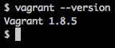
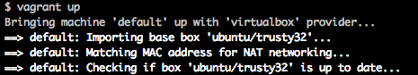

# Cricket Team Submission App : A cricket database 
by Shubham Prakash

## About
A **Cricket Tournament Team Submission Web App** that is based on **_flask framework_** to _Submit_ New **Team** And their **Players**. The web App uses **_SQLAlchemy_** as the **ORM** to provide all the **CRUD Functionality** to _View_, _Create_, _Edit_ and _Delete_ Teams and Players.The website also implement a **Third party authentication and authorization** service and  **Local Permission System** and thus consider _authorization status_ prior to execution of CRUD Functionality. So that, the _User Who created that Team Will only be able to edit/delete the Team and its Players and create new Players Other will only be able to view them_. the  The App also implements a **JSON endpoint** that serves the same information as displayed in the **HTML endpoints** for an arbitrary object in the _Cricket Catalog Web App_.


## STACKS USED
- Python
- Flask
- SQLAlchemy
- SQLite3
- Restful API
- Jinja2
- vagrant 
- virtualbox
- Git


## REQUIREMENTS

1. [**Git**](http://git-scm.com/downloads), Use Git to fork, then clone, the VM configuration.

2. [**VirtualBox**](https://www.virtualbox.org/wiki/Download_Old_Builds_5_1), software that will run your virtual machine

3. [**VAGRANT**](https://www.vagrantup.com/), software that configures the VM and lets you share files between your host computer and the VM's filesystem.

4. Cloned repository `Cricket-Player-Info`


## HOW TO RUN THE VIRTUAL MACHINE

1. Install vagrant, to install you can check the below link. This will give you the database and support software needed for this project

    [Instructions to install the vagrant virtual machine](https://www.udacity.com/wiki/ud088/vagrant)
    
    

2. Use Git to clone, the Repo with the VM configuration.
    
    **Windows:** Use the Git Bash program (installed with Git)     to get a Unix-style terminal. 
    **Other systems:** Use your favorite terminal program.

    From the terminal, run:
    ```sh
    git clone https://github.com/shubhamPrakashJha/Cricket-Player-Info.git Cricketinfo
    ```
3. Go to directory where you cloned the repo, then using the terminal, change directory to  '/Cricketinfo'
    ```sh
    cd /Cricketinfo
    ```


4. Now type `vagrant up` to launch your virtual machine.
	```sh
	 vagrant up
	```
	

5. Once it is up and running, type `vagrant ssh` to log into it. 
	```sh
	 vagrant ssh
	```
    
    
    This will log your terminal in to the virtual machine, and you'll get a Linux shell prompt. 
    
    To **log out**, type `exit` at the shell prompt.  
    To **turn the virtual machine off** (without deleting anything), type `vagrant halt`. 
    If you do this, you'll need to run vagrant up again before you can log into it.
 
6. Now at the vagrant shell prompt, Navigate to the `/vagrant` directory inside the vagrant environment by typing `cd /vagrant`
 
    ```sh
    cd /vagrant
    ```
    this enables to share files between your home machine and the VM.

## INITIALIZATION:  Setup Database and Run the App
To successfully run the `application.py` file in the repository we need to Initialize the **database**.

### 1. create the Databse:
Inside the vagrant change directory to `/vagrant`
```sh
cd /vagrant
```


Run the belopw command to setup the database.
```sh
python database_setup.py
```

This will create a sqlite database file named `teamplayerwithuser.db`

### 2. Initialize the Database 
Populating the `teamplayerwithuser.db` with data using command:
```sh
python lotsofplayerswithuser.py
```

### 3. Run the App
Run the `application.py` file
```sh
python application.py
```

### 4. Open the App
Open application by visiting http://localhost:5000/ locally on your browser.
```sh
http://localhost:5000/
```

## HOW TO USE
Innitialize the Databse and Run the App as Mentioned above.

- #### View the home page 
    Go to url http://localhost:5000/teams/
    Inside app, click on `CRICKET TEAM SUBMISSION APP`
- #### Login
    click on `Login` Button at the Top-Banner
- #### Open Team 
    Click on Team name or Team image.
- #### Add New Team/Player(only if logged in)
    1. click on the PLUS(+) Sign in the home page/Team Page
    2. Create New Team/Player Page will open
    3. Fill The form
    4. To insert image, search/open the  desired image on the web in new browser window.
    5. Right click on the image
    6. Click `on Copy the image Adddress`
    7. Paste it in Image URL text field
    8. click on create button
    9. Click on Cancel button to Cancel creation which redirects you to Home/Team Page
- #### Edit Team/Player info(only if logged in and created by you)
    1. Open the team that you created and want to edit
    2. Click on edit link of Team/PLAYER
    3. Enter the new info in the fields you want to edit
    4. click on Create button
    5. Click on Cancel button to Cancel editing which redirects you to Home/Team Page
- #### Delete Team/Player(only if logged in and created by you)
    1. Open the team that you created and want to edit
    2. Click on delete link of Team/PLAYER
    3. A confirmation page will open
    4. click on Delete button
    5. Click on Cancel button to Cancel Deleting which redirects you to Home/Team Page
- #### Logout
    click on the Logout button at the same place which replaces the Login button after you logged in.


